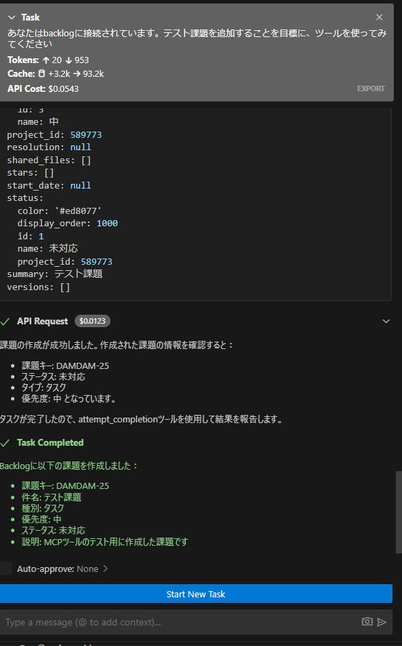

# Backlog MCP (Model Context Protocol) Integration



このプロジェクトは、BacklogのAPIをModel Context Protocol (MCP)を通じて利用可能にするための統合システムです。これにより、AIアシスタントがBacklogの機能（課題の作成、プロジェクト管理など）を直接操作できるようになります。

## プロジェクト構成

このプロジェクトは以下の3つの主要コンポーネントで構成されています：

### 1. Scraper (`/scraper`)

BacklogのAPI仕様をOpenAPI形式で取得するためのコンポーネントです。

- BacklogのAPIドキュメントをスクレイピング
- Markdown形式への変換
- OpenAPI仕様への変換
- 複数のOpenAPI定義のマージ

実行コマンド：
```bash
poetry run python main.py scrape        # APIドキュメントのスクレイピング
poetry run python convert_to-markdown.py # Markdown形式への変換
poetry run python main.py convert       # OpenAPI仕様への変換
poetry run python main.py merge-openapi # OpenAPI定義のマージ
```

### 2. Backlog Client (`/backlog-client`)

Backlog APIのPythonクライアントライブラリです。

- OpenAPI Generator を使用して生成
- スクレイピングで取得したOpenAPI定義から自動生成

クライアント生成コマンド：
```bash
docker run --rm -v "${PWD}:/local" openapitools/openapi-generator-cli:latest generate \
    -i /local/openapi.yaml \
    -g python \
    -o /local/src \
    --additional-properties=packageName=backlog_client
```

### 3. MCP Server (`/mcp-server`)

BacklogのAPIをMCPインターフェースとして提供するサーバーです。

主な機能：
- プロジェクト一覧の取得
- 課題の作成・取得
- 課題タイプの取得
- 優先度の取得

提供されるツール：
- `get_projects`: プロジェクト一覧の取得
- `get_issues`: 課題一覧の取得
- `get_issue_types`: 課題タイプ一覧の取得
- `get_priorities`: 優先度一覧の取得
- `create_issue`: 課題の作成

## セットアップ

1. 環境変数の設定
```bash
export BACKLOG_API_KEY=あなたのBacklogAPIキー
```

2. 依存関係のインストール
```bash
# Scraper
cd scraper
poetry install

# MCP Server
cd mcp-server
poetry install
```

## 技術スタック

- Python
- OpenAPI Generator
- Model Context Protocol (MCP)
- Poetry (依存関係管理)
- Backlog API

## 開発フロー

1. BacklogのAPIドキュメントをスクレイピング
2. OpenAPI仕様を生成
3. Pythonクライアントを生成
4. MCPサーバーを実装
5. AIアシスタントからBacklog APIを利用

## 注意事項

- Backlog APIキーの取り扱いには十分注意してください
- APIの利用制限に注意してください
- 自動生成されたコードは手動で修正しないでください
